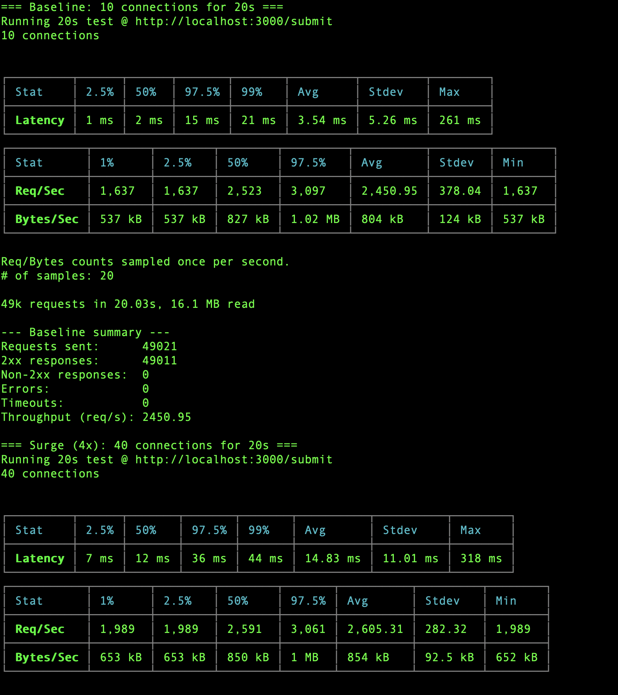
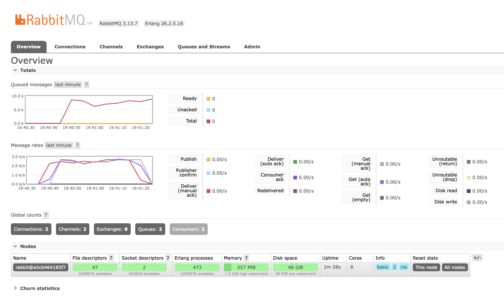
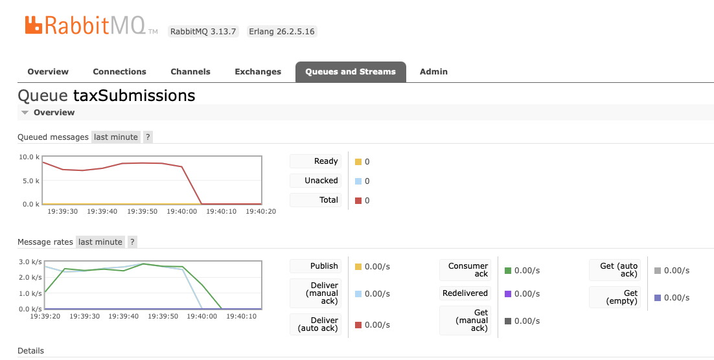

# Tax Submission API with RabbitMQ & Docker

**A production-ready Node.js API** that accepts tax submissions, queues them via **RabbitMQ**, and processes them asynchronously.  
Fully **Dockerized**, with **Swagger UI**, **retry logic**, **health checks**, and **clean architecture**.

---

## Features

| Feature                                  | Status |
| ---------------------------------------- | ------ |
| Express.js API (`POST /submit`)          | Done   |
| RabbitMQ Queue (`taxSubmissions`)        | Done   |
| Async Processing (Subscriber)            | Done   |
| Dead-letter queue (`taxSubmissions.dlq`) | Done   |
| Audit tables (SQLite)                    | Done   |
| Load test (`load-test.js`, autocannon)   | Done   |
| Swagger UI (`/api-docs`)                 | Done   |
| Docker + Docker Compose                  | Done   |
| One-command bring-up (`run.sh`)          | Done   |
| Auto-retry on RabbitMQ startup           | Done   |
| Health Checks                            | Done   |
| Graceful Shutdown                        | Done   |
| Management UI (`http://localhost:15672`) | Done   |

---

## Project Structure

```
rabbitmq-tutorial/
├── Dockerfile
├── docker-compose.yml
├── run.sh                    ← One-command bring-up (build, start, health-check)
├── load-test.js              ← autocannon baseline → surge load test
├── design.md                 ← DLQ / audit / load-test design notes
├── swagger.yaml               ← OpenAPI spec
├── package.json
├── start.js                  ← Entry point (forks API + subscriber)
├── subscriber.js             ← Worker that consumes queue
└── src/
    ├── api.js                ← Express server + Swagger
    ├── rabbitmq.js           ← RabbitMQBuilder with retry + DLQ topology
    ├── publisher.js          ← publishTaxSubmission()
    ├── subscriber.js         ← Queue consumer + DLQ drain
    └── db.js                 ← SQLite audit tables (message_audit, failed_messages)
```

---

## Quick Start

### 1. Clone & Install

```bash
git clone https://github.com/yourname/rabbitmq-tutorial.git
cd rabbitmq-tutorial
npm ci
```

### 2. Run everything with one script (Recommended)

```bash
./run.sh
```

This builds the images, starts RabbitMQ + the API/subscriber, waits for
`/health`, and prints the URLs below. Pass `--with-load-test` to also kick
off `load-test.js` immediately so the RabbitMQ dashboard charts have
something to show:

```bash
./run.sh --with-load-test
```

> API: `http://localhost:3000`  
> Swagger: `http://localhost:3000/api-docs`  
> RabbitMQ UI: `http://localhost:15672` (guest/guest)

You can still use plain `docker compose up --build` if you want manual
control — `run.sh` is just a thin wrapper around it.

---

## Test the API

```bash
curl -X POST http://localhost:3000/submit \
  -H "Content-Type: application/json" \
  -d '{
    "userId": "user-123",
    "taxData": "base64-or-json-tax-file"
  }'
```

**Response:**

```json
{
  "message": "Submission received",
  "confirmation": "a1b2c3d4-..."
}
```

**Subscriber logs after ~3s:**

```
[Subscriber] Processing: a1b2c3d4-... for user-123
[Subscriber] Done: a1b2c3d4-...
```

---

## Dead-letter Queue (DLQ)

Failed processing doesn't disappear — messages are dead-lettered into
`taxSubmissions.dlq` instead of being dropped or retried forever.

Trigger it manually by setting `simulateFailure: true` on a submission:

```bash
curl -X POST http://localhost:3000/submit \
  -H "Content-Type: application/json" \
  -d '{"userId":"demo","taxData":"x","simulateFailure":true}'
```

The subscriber throws on that message, `nack`s it without requeueing, and
RabbitMQ routes it to `taxSubmissions.dlq` via the `taxSubmissions.dlx`
exchange. A second consumer drains the DLQ and records the full payload into
the `failed_messages` table. See [design.md](design.md) for the full
topology.

## Audit Tables

A SQLite database (`better-sqlite3`, file at `DB_PATH`, default
`./data/app.db` — `/app/data/app.db` inside Docker, persisted in the
`dbdata` volume) tracks message lifecycle:

| Table             | Columns                                            | Purpose                                  |
| ----------------- | --------------------------------------------------- | ----------------------------------------- |
| `message_audit`   | `message_id` (PK), `status`, `processed_at`         | Current state of every message            |
| `failed_messages` | `id`, `message_id`, `queue`, `payload`, `error`, `failed_at` | Full record of every dead-lettered message |

Inspect them directly:

```bash
docker compose exec api node -e "
  const { db } = require('./src/db');
  console.log(db.prepare('SELECT * FROM message_audit').all());
  console.log(db.prepare('SELECT * FROM failed_messages').all());
"
```

## Load Testing

```bash
npm run load-test
```

`load-test.js` (autocannon) drives `POST /submit` at a baseline connection
count, then at 3–5x that (default 4x, tunable via `LOAD_MULTIPLIER`), and
fails (non-zero exit) if any requests error out, time out, or return a
non-2xx status. Tune with env vars:

| Variable               | Default | Description                       |
| ----------------------- | ------- | ---------------------------------- |
| `LOAD_TEST_URL`          | `http://localhost:3000/submit` | Target endpoint    |
| `BASELINE_CONNECTIONS`   | `10`    | Baseline concurrent connections    |
| `LOAD_MULTIPLIER`        | `4`     | Surge multiplier (3-5 recommended) |
| `LOAD_DURATION`          | `20`    | Seconds per phase                  |

Run it while watching `http://localhost:15672` → **Overview → Message
rates** or the `taxSubmissions` queue page to see the traffic surge as a
live chart.

Sample run (baseline → 4x surge, zero dropped requests):



---

## Endpoints

| Method | URL         | Description     |
| ------ | ----------- | --------------- |
| `POST` | `/submit`   | Submit tax data |
| `GET`  | `/api-docs` | Swagger UI      |
| `GET`  | `/health`   | Health check    |

---

## Health Check

```bash
curl http://localhost:3000/health
```

```json
{ "status": "healthy", "rabbitmq": "connected" }
```

---

## RabbitMQ Management

- **URL**: [http://localhost:15672](http://localhost:15672)
- **Credentials**: `guest` / `guest`
- **Queue**: `taxSubmissions` (durable)

**Overview tab** — global message rates and totals across all queues:



**Per-queue tab** (`Queues and Streams` → `taxSubmissions`) — rate chart scoped to a single queue, useful for watching the DLQ (`taxSubmissions.dlq`) in isolation:



---

## Local Development (without Docker)

```bash
# Start RabbitMQ (Docker)
docker run -d --name rabbitmq -p 5672:5672 -p 15672:15672 rabbitmq:3-management

# Start API + Subscriber
node start.js
```

> Ensure `RABBITMQ_URL=amqp://localhost:5672` in `.env` or environment.

---

## Docker Compose Commands

```bash
# Start
docker compose up --build

# Stop
docker compose down

# Clean (remove volumes)
docker compose down -v

# View logs
docker compose logs -f api
```

---

## Environment Variables

| Variable       | Default                | Description         |
| -------------- | ---------------------- | ------------------- |
| `PORT`         | `3000`                 | API port            |
| `RABBITMQ_URL` | `amqp://rabbitmq:5672` | RabbitMQ connection |
| `DB_PATH`      | `./data/app.db`        | SQLite audit DB path |

---

## Swagger UI

Open: [http://localhost:3000/api-docs](http://localhost:3000/api-docs)

- Try `POST /submit`
- See request/response schemas
- Download OpenAPI spec

---

## Graceful Shutdown

Supports `SIGTERM` and `SIGINT`:

- Closes RabbitMQ connection
- Drains in-flight messages
- Exits cleanly

---

## Troubleshooting

| Issue                     | Fix                                   |
| ------------------------- | ------------------------------------- |
| `ENOENT: ../swagger.yaml` | Use `/app/swagger.yaml` in `api.js`   |
| `ECONNREFUSED`            | Retry logic auto-handles it           |
| `No operations in spec`   | Ensure `swagger.yaml` is copied       |
| Container exits           | Check logs: `docker compose logs api` |

---

## Contributing

1. Fork it
2. Create your feature branch (`git checkout -b feature/xyz`)
3. Commit (`git commit -am 'Add xyz'`)
4. Push (`git push origin feature/xyz`)
5. Open a Pull Request

---

## License

MIT © Your Name

---

**Built with love, Docker, and RabbitMQ**  
_Now go submit some taxes!_
